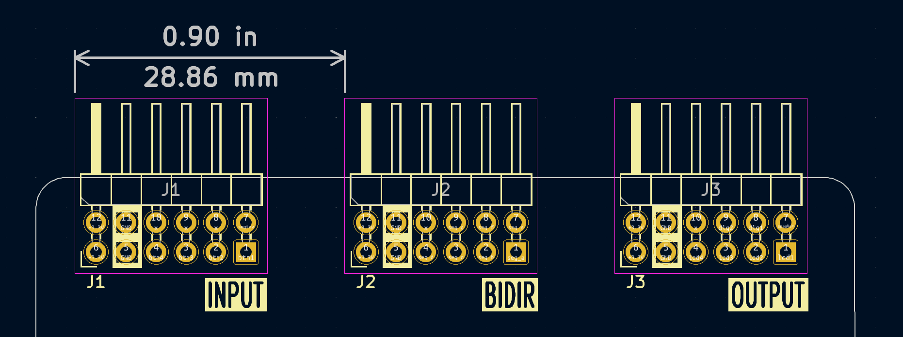

# Tiny Tapeout PMOD KiCad Library

This is a KiCad library for the Tiny Tapeout PMODs. The PMODs plug to the Tiny Tapeout board, using up to three 6x2 PMOD connectors: one for the eight input signals (`ui_in`), one for the eight output signals (`uo_out`), and one for the eight bidirectional signals (`uio`).

## Library Contents

### PMOD connectors

The symbol for the PMOD connector is `PMOD_PERIPH_2x6` and the footprint is `PinHeader_2x06_P2.54mm_PMODPeriph2B`.

If you are using more than a single PMOD connector, the connectors should be placed as follows:

You can achieve this using the "Position Relative To" (Shift+P) function in the PCB Editor, setting "Offset X" to 0.9 inch / 22.86 mm. This will ensure that the connectors are placed at the correct distance from each other.

Place the input connector on the left, the bidirectional connector in the middle, and the output connector on the right (when looking at the board from the top).

### Logo

You can add the "Designed for Tiny Tapeout" logo to your board. The logo comes in two sizes:

- `TT_PMOD_Logo_7mm` - 7 mm diameter
- `TT_PMOD_Logo_10mm` - 10 mm diameter

## License

The library is licensed under the [Apache License 2.0](LICENSE).
